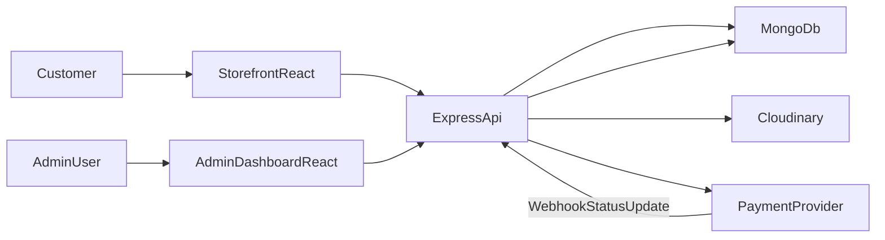

# Request Flow

## End-to-End Flow

## Sequence (Checkout Example)

1. Customer checks out from `storefront`.
2. API re-validates products, stock status, and price.
3. API creates order with item snapshots and `pending_payment` (or `bank_transfer_pending`).
4. API creates payment session through provider adapter for online methods.
5. Provider redirects customer and later calls webhook endpoint.
6. API verifies webhook signature and updates `payments` and order payment status atomically.
7. Admin monitors and continues operational order status updates from `admin`.

## API Boundary Rule

Only backend owns:

- financial calculations
- order/payment status transitions
- inventory trust decisions
- security and role checks
