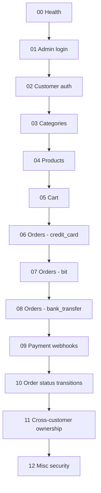

# veg-store API - Postman Collection

This folder ships a single, exhaustive Postman collection that exercises every endpoint, role, validation branch, and status transition in `apps/api`.

## Files

- `veg-store.postman_collection.json` - the collection (13 folders, 120 requests, all chained via Postman environment variables).
- `veg-store.postman_environment.json` - the matching environment (base URL, secrets, runtime variables).
- `sample-product.png` - a 1x1 PNG written by the seed script. Used by all `POST/PATCH /products` requests.

## One-time setup

The API has no public admin-creation endpoint, so admins must be seeded directly into MongoDB. There is also no fixture image checked into the repo, so the multipart `image` field needs a real file on disk. Both are handled by the seed script.

```bash
cd apps/api
npm install                # if you haven't already
npm run seed:postman       # uses defaults: admin@local.test / Admin12345!

# or with custom credentials:
npm run seed:postman -- --email admin@example.com --password Strong-Pass-123!
```

The script will:

1. Connect to MongoDB using the same `apps/api/.env` configuration as the API.
2. Upsert an admin user (idempotent - re-runs just refresh the password and role).
3. Decode a hardcoded base64 PNG into `poostman/sample-product.png`.
4. Print a summary block - copy those values into the Postman environment.

Make sure the API is running before importing the collection:

```bash
cd apps/api
npm run dev
```

> **Cloudinary note.** `POST /products` calls Cloudinary directly (not mocked outside of Jest). Either set valid `CLOUDINARY_CLOUD_NAME / API_KEY / API_SECRET` in `apps/api/.env`, or expect the product create requests to return `500`. Everything else in the collection runs without Cloudinary.

## Importing into Postman

1. Postman -> `Import` -> drop both JSON files.
2. Top-right environment selector -> pick `veg-store local`.
3. Open the environment, set:
   - `baseUrl` (default `http://localhost:5000/api/v1`).
   - `adminEmail` / `adminPassword` to whatever you used with `seed:postman`.
   - `webhookSecret` to your `PAYMENT_WEBHOOK_SECRET` from `apps/api/.env`.
   - `sampleImagePath` to the **absolute** path printed by `seed:postman` (e.g. `C:\Users\you\...\docs\postman\sample-product.png`).
4. Save the environment.

## Running

### From the Postman UI

`Runner` -> select `veg-store API (exhaustive)` -> select the `veg-store local` environment -> `Run`. The folders must run **in order (00 -> 12)** because later requests depend on variables saved by earlier ones (admin token, category id, product id, order ids, etc.).

### From the CLI with Newman

```bash
npm install -g newman
newman run poostman/veg-store.postman_collection.json \
  -e poostman/veg-store.postman_environment.json
```

## Run order



## What is covered

| # | Folder | Coverage |
|---|---|---|
| 00 | Health | `GET /health` smoke check, JSON content type, ISO timestamp |
| 01 | Admin login | seeded admin login, `GET /admin/ping` welcome message |
| 02 | Customer auth | register, duplicate email 409, missing fields 400, login 200/401/400, `/auth/me` no/invalid/valid token, customer-on-admin route 403 |
| 03 | Categories | admin CRUD, slug normalization, duplicate 409, no-auth 401, customer-forbidden 403, freeze visibility on public list, soft delete |
| 04 | Products | multipart create, `salePrice > price` 400, missing/invalid category 404, missing image 400, wrong field 400, RBAC 401/403, list/search/category filters, `:id` 200/400/404, freeze hides from public, soft delete, admin sees all |
| 05 | Cart | unauth 401, add/update/remove/clear, missing productId 400, qty=0 400, unknown product 404, out-of-stock 400, frozen 404, checkout prepare empty 400 / with items 200 |
| 06 | Orders - credit_card | order creation, pricing math (`total = subtotal + 15` for `zone_a`), cart cleared, ownership list/detail, validation negatives (empty cart, missing phone, bad zone), admin-on-customer-route 403, invalid id 400 |
| 07 | Orders - bit | bit method also goes to `pending_payment` |
| 08 | Orders - bank_transfer | initial `bank_transfer_pending`, customer-on-admin 403, admin on credit_card 400, approval 200, double-approval 400 |
| 09 | Payment webhooks | wrong/missing secret 401, success -> paid, fail -> failed, cancelled -> cancelled, idempotent replay (`duplicate: true`), already-paid 400, bank-transfer rejected 400, unknown order 404, missing `outcome` 400 |
| 10 | Order status flow | full happy path `new -> confirmed -> sent_with_delivery_company -> delivered`, invalid skip 400, terminal cancellation 400, `new -> cancelled` 200, admin filter `?orderStatus=delivered`, no-auth 401, customer 403, admin detail 200 |
| 11 | Cross-customer ownership | customer B cannot view customer A's order (404) |
| 12 | Misc security | malformed JSON body, malformed `Authorization: Bearer` header |

## Re-running

The collection mostly cleans up after itself per request, but it leaves behind:

- One admin user (idempotent - safe to re-run).
- Categories / products created with `Date.now()`-suffixed names (each run adds new docs).
- Orders for the run.

If you want a clean slate, drop the database (`mongo myDb --eval "db.dropDatabase()"` or wipe your Mongo memory volume) and re-run `npm run seed:postman` before the next run.

## Maintenance notes

- Adding a new endpoint? Add it to the appropriate numbered folder so the chained variables stay valid.
- Changing a status enum or delivery fee? Update the matching `pm.test` assertions in folders 06 and 10.
- This collection complements but does not replace the Jest integration tests in `apps/api/tests/integration/`. Use Jest for fast pre-commit testing; use this collection for manual exploration, demos, and end-to-end verification against a real Mongo + Cloudinary deployment.
